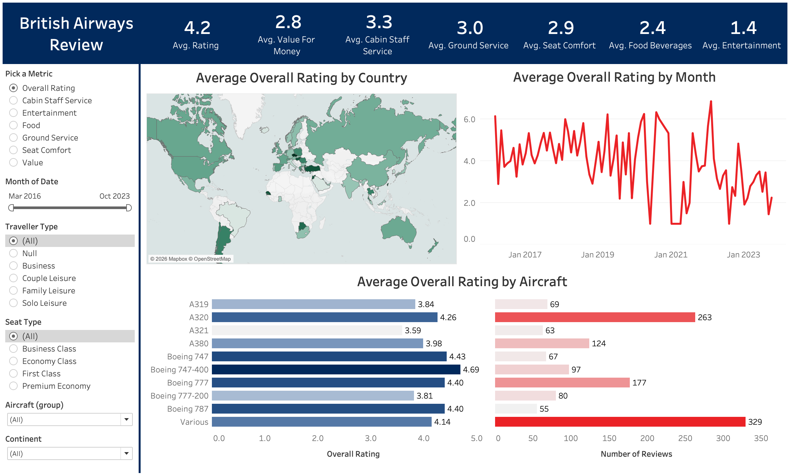
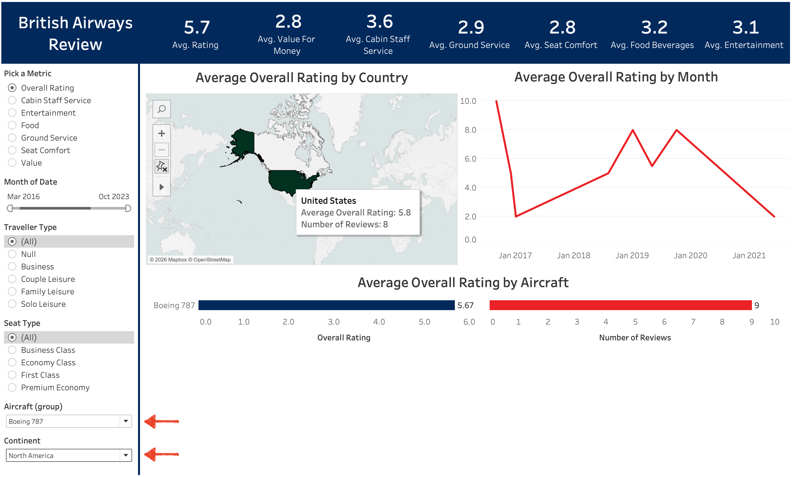

# British Airways Customer Review Dashboard

## Project Overview
This Tableau dashboard analyzes customer reviews of British Airways flights to evaluate passenger satisfaction across time, geography, aircraft type, and service categories. The goal is to identify trends and service areas that most strongly influence perceived value and overall ratings.

The dashboard is designed for stakeholder use and enables interactive filtering by metric, traveler type, seat class, aircraft, region, and time period.

---

## Live Dashboard
View the interactive dashboard on Tableau Public: https://public.tableau.com/views/BritishAirwaysReviewDashboard_17671369450550/Dashboard1?:language=en-US&:sid=&:redirect=auth&:display_count=n&:origin=viz_share_link

---

## Key Takeaways 
- Entertainment and food score consistently lower than other service dimensions, indicating targeted improvements in these areas could significantly improve overall customer satisfaction.
- Wide-body aircrafts (e.g., Boeing 777/787) receive higher value ratings than older aircraft models, suggesting fleet composition plays a meaningful role in perceived value.

---

## Key Metrics
- Overall Rating
- Value for Money
- Cabin Staff Service
- Ground Service
- Seat Comfort
- Food & Beverages
- Entertainment

---

## Business Questions Answered
- How has customer-perceived value changed over time?
- Which countries report higher or lower satisfaction?
- How do different aircraft types compare in terms of passenger value ratings?
- Which service dimensions (seat comfort, food, entertainment, ground service) score lowest?

---

## Dashboard Interactivity

---
## Data Sources
- British Airways Reviews Dataset (`ba_reviews.csv`)
- Country Reference Dataset (`Countries.csv`)
  
---

## Tools Used
- Tableau Desktop
- CSV datasets
- Calculated fields, parameters, filters, and dashboard actions

---

## Contact
For questions, please contact: **jlin673@gatech.edu**

